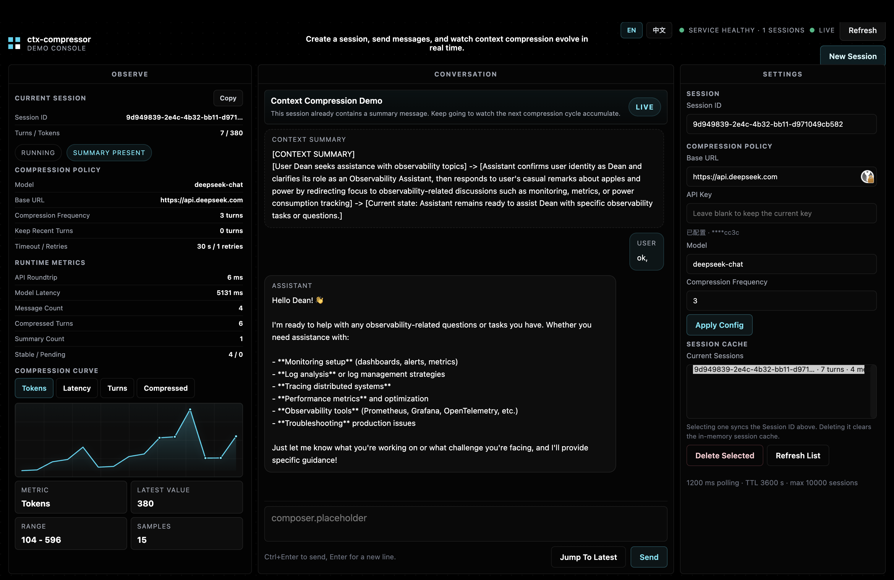

# ctx-cache-compressor

[中文说明](./README.zh-CN.md)

> Redis-like context cache and async history compressor for long-running OpenAI-compatible LLM conversations.



`ctx-cache-compressor` is a Rust service that stores conversation state per session, returns a live merged context view, and compresses older turns in the background through an OpenAI-compatible model.

The short version:

- your application owns assistant behavior and product logic
- `ctx-cache-compressor` owns context storage, caching, and history compression

## What It Does

- stores `system`, `user`, `assistant`, and `tool` messages per session
- keeps a non-blocking merged context view: `stable + pending`
- compresses only at safe turn boundaries
- keeps recent turns verbatim and summarizes older history asynchronously
- exposes both core service APIs and a built-in `/compressor` demo page

## What It Is Not

- not a full chat product
- not a database-backed memory platform
- not a vector database or RAG layer
- not an agent runtime

## Core Model

Each session has two buffers:

- `stable`: the current confirmed context snapshot
- `pending`: messages appended while compression is running

Invariant:

`full context = stable + pending`

That gives the service its main property:

- `append` does not wait for compression
- `fetch` does not wait for compression
- compression works on a snapshot
- failures degrade gracefully without losing messages

Compression only runs at completed turn boundaries:

- simple turn: `user -> assistant`
- tool turn: `user -> assistant(tool_calls) -> tool... -> assistant`

## Quick Start

Requirements:

- Rust stable
- `cargo`
- an OpenAI-compatible upstream endpoint
- an API key for that endpoint

Create local config:

```bash
cp config.example.toml config.toml
cp .env.example .env.local
```

Set `OPENAI_API_KEY` in `.env.local`, then load it:

```bash
source scripts/source_env.sh .env.local
```

Run locally:

```bash
cargo run
```

Health check:

```bash
curl -sS http://127.0.0.1:8080/health | jq .
```

Open the playground:

```text
http://127.0.0.1:8080/compressor
```

## Core Routes

- `POST /sessions`
- `GET /sessions`
- `DELETE /sessions/{session_id}`
- `POST /sessions/{session_id}/messages`
- `GET /sessions/{session_id}/context`
- `GET /health`

Demo helpers:

- `GET /demo/config`
- `PATCH /demo/config`
- `POST /demo/chat`

UI routes:

- `/compressor`
- `/ex/dashboard`
- `/ex/playground`

## Recommended Production Flow

1. create a session
2. append the user message
3. fetch the merged context
4. call your own LLM with that context
5. append the assistant message
6. repeat

This service should sit between your application and the upstream model. It manages context state; your application still owns the final response behavior.

## Deployment

Build and run a release binary:

```bash
cargo build --release
CONFIG_FILE=deploy/config/prod.toml scripts/run_release.sh
```

Package a release archive for the current or specified target:

```bash
scripts/package_release.sh
TARGET=x86_64-unknown-linux-gnu scripts/package_release.sh
```

The archive name includes the Rust target triple, for example:

```text
ctx-cache-compressor-0.1.0-x86_64-unknown-linux-gnu.tar.gz
```

Other deployment paths already included in the repo:

- Docker: [Dockerfile](./Dockerfile)
- systemd: [deploy/systemd/ctx-cache-compressor.service](./deploy/systemd/ctx-cache-compressor.service)
- production configs: [deploy/config/prod.toml](./deploy/config/prod.toml)

## Release Strategy

This project is a backend service, not a desktop application. That means:

- you do not need Windows/macOS installers by default
- you do not need per-platform GUI packaging
- you only need platform-specific binaries if you want to distribute the server directly

Recommended GitHub Releases strategy:

- always publish a tagged source release
- publish a Linux tarball first if your real deployment target is Linux
- publish a Docker image if you expect container-based deployment
- add macOS binaries only if maintainers or users commonly run it locally outside Docker
- skip Windows installers unless there is real operator demand

For most teams, `Linux binary + Docker image + source tag` is enough.

This repo includes a GitHub Actions workflow that builds and publishes an `x86_64-unknown-linux-gnu` release artifact when you push a tag such as `v0.1.0`.

## Testing

Run the main suite:

```bash
cargo test
```

Useful helpers:

```bash
scripts/test_suite.sh quick
scripts/smoke.sh
```

## Docs

- [Project Overview](./docs/project-overview.md)
- [API & Observability Map](./docs/api-observability-map.md)
- [Chinese README](./README.zh-CN.md)
