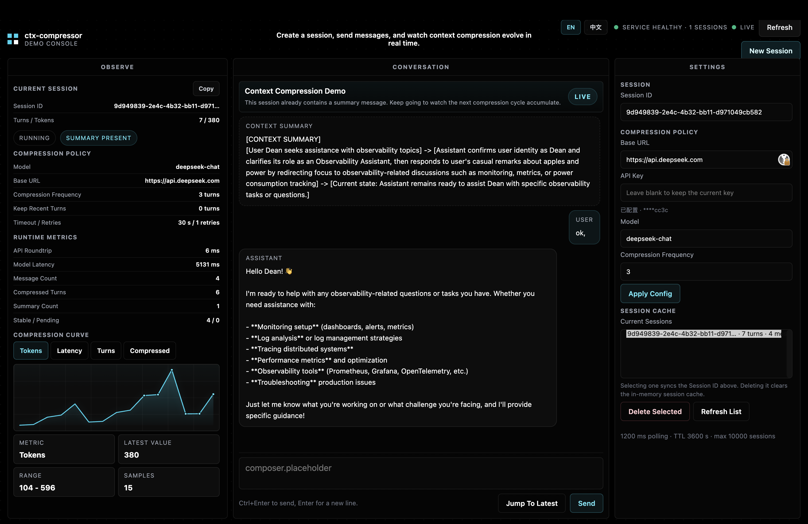

# ctx-cache-compressor

[中文说明](./README.zh-CN.md)

> Redis-like context cache and async history compressor for long-running OpenAI-compatible LLM conversations.



`ctx-cache-compressor` is a Rust service that stores conversation state per session, returns a live merged context view, and compresses older turns in the background through an OpenAI-compatible model.

The short version:

- your application owns assistant behavior and product logic
- `ctx-cache-compressor` owns context storage, caching, and history compression

## What It Does

- stores `system`, `user`, `assistant`, and `tool` messages per session
- keeps a non-blocking merged context view: `stable + pending`
- compresses only at safe turn boundaries
- keeps recent turns verbatim and summarizes older history asynchronously
- exposes both core service APIs and a built-in `/compressor` demo page

## What It Is Not

- not a full chat product
- not a database-backed memory platform
- not a vector database or RAG layer
- not an agent runtime

## Core Model

Each session has two buffers:

- `stable`: the current confirmed context snapshot
- `pending`: messages appended while compression is running

Invariant:

`full context = stable + pending`

`GET /sessions/{session_id}/context` always returns that full canonical context.
After compression, older detailed turns are represented by a `[CONTEXT SUMMARY]`
message, while recent turns and any in-flight messages remain detailed.

That gives the service its main property:

- `append` does not wait for compression
- `fetch` does not wait for compression
- compression works on a snapshot
- failures degrade gracefully without losing messages

Compression only runs at completed turn boundaries:

- simple turn: `user -> assistant`
- tool turn: `user -> assistant(tool_calls) -> tool... -> assistant`

Compression is intentionally turn-based, while still requiring a completed turn
boundary:

- `compression.every_n_turns`: compress after N completed turns

## Quick Start

Requirements:

- Rust stable
- `cargo`
- an OpenAI-compatible upstream endpoint
- an API key for that endpoint

Create local config:

```bash
cp config.example.toml config.toml
cp .env.example .env.local
```

Set `OPENAI_API_KEY` in `.env.local`, then load it:

```bash
source scripts/source_env.sh .env.local
```

Run locally:

```bash
cargo run
```

The default binary keeps the historical combined behavior: core API routes plus
demo/UI routes when `server.enable_demo_routes = true`.

You can also run the production API and demo surface as separate services:

```bash
cargo run --bin ctx-cache-compressor-api
cargo run --bin ctx-cache-compressor-demo
```

`ctx-cache-compressor-api` exposes only the core API routes and is the preferred
production entrypoint. `ctx-cache-compressor-demo` serves the playground and demo
helpers for local inspection; the `/compressor` page also has an API Base field
so it can point at a separately deployed API service.

Health check:

```bash
curl -sS http://127.0.0.1:8080/health | jq .
```

Open the playground:

```text
http://127.0.0.1:8080/compressor
```

For production core API deployments, prefer the API-only binary and disable
permissive CORS unless browser callers need it:

```toml
[server]
permissive_cors = false
```

## Core Routes

- `POST /sessions`
- `GET /sessions`
- `DELETE /sessions/{session_id}`
- `POST /sessions/{session_id}/messages`
- `GET /sessions/{session_id}/context`
- `GET /health`

Demo helpers:

- `GET /demo/config`
- `PATCH /demo/config`
- `POST /demo/chat`
- `POST /demo/tool-call`
- `POST /demo/complete`

UI routes:

- `/compressor`
- `/ex/dashboard`
- `/ex/playground`

The compatibility binary exposes demo and UI routes only when
`server.enable_demo_routes = true`. The API-only binary never exposes demo/UI
routes. The demo binary is intended for local display and testing.
`/demo/tool-call` accepts an OpenAI-compatible `tools` array and asks the
configured conversation model to choose between a normal assistant reply and
`assistant(tool_calls)`. `/demo/complete` continues after the matching `tool`
result has been appended. If the upstream model returns provider-specific
`reasoning_content`, the demo preserves it in the assistant message and sends it
back on continuation requests.

## Recommended Production Flow

1. create a session
2. append the user message
3. fetch the merged context
4. call your own LLM with that context
5. append the assistant message
6. repeat

This service should sit between your application and the upstream model. It manages context state; your application still owns the final response behavior.

## Deployment

Build and run the production API binary:

```bash
cargo build --release --locked --bin ctx-cache-compressor-api
OPENAI_API_KEY=sk-... \
CTX_CACHE_COMPRESSOR_CONFIG_FILE=deploy/config/prod.toml \
target/release/ctx-cache-compressor-api
```

Package a release archive for the current or specified target:

```bash
scripts/package_release.sh
TARGET=x86_64-unknown-linux-gnu scripts/package_release.sh
```

By default the archive includes all three binaries. To publish a single
production API binary package:

```bash
BINARIES=ctx-cache-compressor-api scripts/package_release.sh
```

The archive name includes the Rust target triple, because each platform needs a
different binary:

```text
ctx-cache-compressor-0.1.0-x86_64-unknown-linux-gnu.tar.gz
```

For Linux, use the `x86_64-unknown-linux-musl` archive when you want the closest
equivalent to a Go-style static binary. The project uses Rustls, so release
binaries do not require OpenSSL to be installed separately.

From an extracted package, run:

```bash
OPENAI_API_KEY=sk-... scripts/run_release.sh
```

`scripts/run_release.sh` defaults to `SERVICE=api`; use `SERVICE=demo` for the
display service or `SERVICE=compat` for the combined compatibility service.

Other deployment paths already included in the repo:

- Docker: [Dockerfile](./Dockerfile)
- systemd: [deploy/systemd/ctx-cache-compressor.service](./deploy/systemd/ctx-cache-compressor.service)
- production configs: [deploy/config/prod.toml](./deploy/config/prod.toml)

## Release Strategy

This project is a backend service, not a desktop application. That means:

- you do not need Windows/macOS installers by default
- you do not need per-platform GUI packaging
- you only need platform-specific binaries if you want to distribute the server directly

Recommended GitHub Releases strategy:

- always publish a tagged source release
- publish a Linux tarball first if your real deployment target is Linux
- publish a Docker image if you expect container-based deployment
- add macOS binaries only if maintainers or users commonly run it locally outside Docker
- skip Windows installers unless there is real operator demand

For most teams, `Linux binary + Docker image + source tag` is enough.

This repo includes a GitHub Actions workflow that builds and publishes Linux,
macOS, and Windows release archives when you push a tag such as `v0.1.0`.
See [Release Guide](./docs/release.md) for the full publishing checklist.

## Testing

Run the main suite:

```bash
cargo test
```

Useful helpers:

```bash
scripts/test_suite.sh quick
scripts/smoke.sh
```

## Docs

- [Project Overview](./docs/project-overview.md)
- [API & Observability Map](./docs/api-observability-map.md)
- [Release Guide](./docs/release.md)
- [Chinese README](./README.zh-CN.md)
